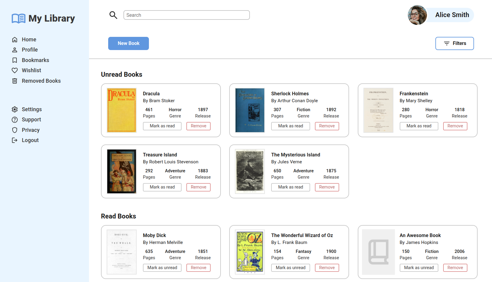

# Library

## Description

- It's a library app interface built with HTML, CSS and JavaScript. It include grid-based sections displaying cards that represent books, which can be added via a form, marked as read/unread and be removed.
- **Features:**
    - JavaScript’s object constructors
    - A grid-based layout
    - Interactive cards representing books
    - Interactive dialog box that shows a form to enter a new book
- Note: Some buttons are just decorative. The file input element for book cover is decorative and does not actually upload files. This is because, for security reasons, browsers do not allow access to the full local file path from an `<input type="file">`. The element is included only to simulate how a file selector would appear in a real application with a backend server.

## Live Demo

**[Click here](https://pedroasb.github.io/library/)** to try out this project on browser.

## Screenshots

## About the Project

This project is part of the curriculum of [The Odin Project](https://www.theodinproject.com/). You can check out other projects that I've built in my [fullstack-journey](https://github.com/PedroASB/fullstack-journey) repository.

## Attributions

- **Fonts**
    - Font copyright © 2011 The Roboto Project Authors – Licensed under the [SIL Open Font License, Version 1.1](https://openfontlicense.org/). Source: https://github.com/googlefonts/roboto-classic
- **Icons**
    - Icons by [Google](https://fonts.google.com/icons) – Licensed under Apache 2.0
- **Images**
    - Photo by Vinicius Wiesehofer: https://www.pexels.com/photo/closeup-photo-of-smiling-woman-wearing-blue-denim-jacket-1130626/
    - Dracula's book cover by Unknown author - here, Public Domain, https://commons.wikimedia.org/w/index.php?curid=99052792
    - Moby Dick's book cover by The original uploader was Chick Bowen at English Wikipedia. - Transferred from en.wikipedia to Commons., Public Domain, https://commons.wikimedia.org/w/index.php?curid=2081025
    - Sherlock Holmes's book cover by Rtrace (upload first version)User:ΛΦΠ (upload second version) - [OpenLibrary.org](http://openlibrary.org/), Public Domain, https://commons.wikimedia.org/w/index.php?curid=3086918
    - Frankenstein's book cover by Mary Shelley - Cropped and slightly rotated from https://www.christies.com/lot/lot-6332204, Public Domain, https://commons.wikimedia.org/w/index.php?curid=160685660
    - Treasure Island's book cover by Robert Louis Stevenson - Available in the BEIC digital library and uploaded in partnership with BEIC Foundation.Internet Archive identifier: treasureisland00stev, Public Domain, https://commons.wikimedia.org/w/index.php?curid=38870014
    - The Wonderful Wizard of Oz's book cover by William Wallace Denslow - Electronic Text Center, University of Virginia Library, Public Domain, https://commons.wikimedia.org/w/index.php?curid=3470848
    - The Mysterious Island's book cover by Jules Verne / Jules Férat / Charles Barbant - Hetzel edition of The Mysterious Island, Public Domain, https://commons.wikimedia.org/w/index.php?curid=66142